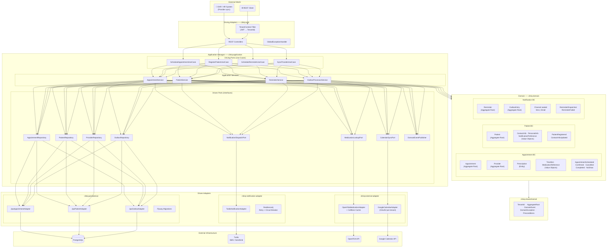
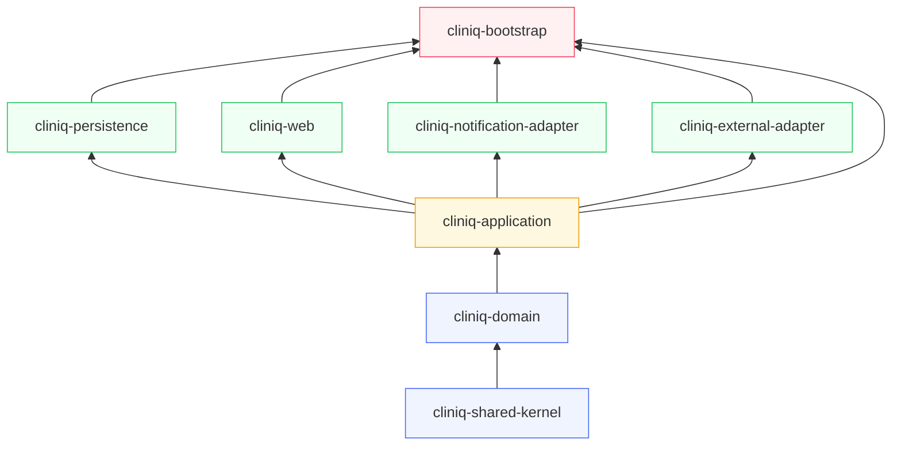
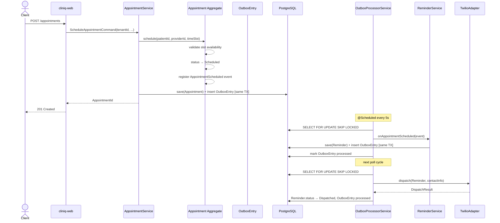

# Patient Appointment & Reminder System — Architectural Plan

---

## Diagrams

### 1. Hexagonal Architecture — Layers & Adapters



---

### 2. Maven Module Dependency Graph



---

### 3. Bounded Context & Event Flow



---

## Context

Greenfield backend for a multi-tenant clinic scheduling platform. The system must support appointment booking, provider availability, patient management, medication references (via OpenFDA), SMS/email reminders (via Twilio), and Google Calendar sync. Architecture is strictly Hexagonal (Ports & Adapters) + DDD. Implementation proceeds one layer at a time.

---

## Bounded Contexts

| BC | Classification | Owns |
|---|---|---|
| **Appointment Scheduling** | Core Domain | Appointment, Provider (reference), Prescription |
| **Patient** | Supporting Domain | Patient, NotificationPreference |
| **Notification** | Supporting Domain | Reminder, OutboxEntry |
| **Medication Reference** | Generic Subdomain | Read-only ACL over OpenFDA — no aggregate |

Google Calendar sync = driven adapter in Appointment BC (not its own BC).
Provider = reference data synced from external system; no full lifecycle events.

---

## Maven Multi-Module Structure

```
cliniq/                              ← parent pom (dependency management only)
├── cliniq-shared-kernel/            ← TenantId, AggregateId base, DomainEvent base, Money, etc.
├── cliniq-domain/                   ← ALL domain logic, pure Java 21, zero Spring/JPA
├── cliniq-application/              ← Use cases + all port interfaces (driving + driven)
├── cliniq-persistence/              ← JPA entities, repositories, Flyway migrations
├── cliniq-web/                      ← REST controllers, request/response DTOs, OpenAPI
├── cliniq-notification-adapter/     ← Twilio SMS/email adapter
├── cliniq-external-adapter/         ← OpenFDA + Google Calendar ACL adapters
└── cliniq-bootstrap/                ← Spring Boot main class, config wiring, Docker Compose
```

**Dependency rules (enforced via Maven + ArchUnit):**
- `domain` depends only on `shared-kernel`
- `application` depends on `domain` + `shared-kernel`
- `persistence`, `web`, `notification-adapter`, `external-adapter` depend on `application` + `domain`
- `bootstrap` depends on everything (wiring only)
- No module may depend on `bootstrap`

---

## Shared Kernel — `cliniq-shared-kernel`

```
com.cliniq.shared/
├── domain/
│   ├── TenantId.java              ← record TenantId(UUID value)
│   ├── AggregateRoot.java         ← abstract class; holds List<DomainEvent>, registerEvent()
│   ├── DomainEvent.java           ← non-sealed interface; eventId, occurredAt, tenantId
│   ├── DomainException.java       ← root of exception hierarchy
│   └── ValueObject.java           ← marker interface
└── validation/
    └── Preconditions.java         ← requireNonNull, requireNotBlank, requirePositive helpers
```

---

## Domain Model — `cliniq-domain`

### Package Structure

```
com.cliniq.domain/
├── appointment/
│   ├── Appointment.java
│   ├── AppointmentId.java
│   ├── AppointmentStatus.java      ← sealed: Scheduled | Confirmed | Cancelled | Completed | NoShow
│   ├── AppointmentType.java
│   ├── TimeSlot.java               ← record: LocalDate, LocalTime start, LocalTime end
│   ├── CancellationReason.java     ← record (code + description)
│   ├── Prescription.java           ← entity (child of Appointment aggregate)
│   ├── PrescriptionId.java
│   ├── MedicationReference.java    ← value object: ndcCode, brandName, genericName
│   ├── event/
│   │   ├── AppointmentScheduled.java
│   │   ├── AppointmentConfirmed.java
│   │   ├── AppointmentCancelled.java
│   │   ├── AppointmentCompleted.java
│   │   └── AppointmentMarkedNoShow.java
│   └── exception/
│       ├── AppointmentNotFoundException.java
│       ├── SlotUnavailableException.java
│       ├── InvalidStatusTransitionException.java
│       └── AppointmentDomainException.java
│
├── provider/
│   ├── Provider.java               ← aggregate root (reference data, externally owned)
│   ├── ProviderId.java
│   ├── ProviderName.java           ← value object: givenName, familyName
│   ├── Specialty.java              ← enum
│   ├── AvailabilitySlot.java       ← value object: DayOfWeek, LocalTime start/end
│   └── exception/
│       └── ProviderNotFoundException.java
│
├── patient/
│   ├── Patient.java
│   ├── PatientId.java
│   ├── PersonalInfo.java           ← record: givenName, familyName, LocalDate dob, Gender
│   ├── ContactInfo.java            ← record: PhoneNumber, EmailAddress
│   ├── PhoneNumber.java            ← value object with E.164 validation
│   ├── EmailAddress.java           ← value object with format validation
│   ├── MedicalRecordNumber.java    ← value object
│   ├── NotificationPreference.java ← record: Channel preferredChannel, boolean optedOut
│   ├── Gender.java                 ← enum
│   ├── event/
│   │   ├── PatientRegistered.java
│   │   ├── ContactInfoUpdated.java
│   │   └── NotificationPreferenceChanged.java
│   └── exception/
│       ├── PatientNotFoundException.java
│       └── PatientDomainException.java
│
└── notification/
    ├── Reminder.java
    ├── ReminderId.java
    ├── ReminderStatus.java         ← sealed: Pending | Dispatched | Delivered | Failed
    ├── Channel.java                ← sealed: Sms | Email
    ├── FailureReason.java          ← value object: code + message
    ├── OutboxEntry.java            ← aggregate root for outbox pattern
    ├── OutboxEntryId.java
    ├── event/
    │   ├── ReminderScheduled.java
    │   ├── ReminderDispatched.java
    │   └── ReminderFailed.java
    └── exception/
        └── NotificationDomainException.java
```

### Key Aggregate Invariants

**Appointment:**
- `schedule()` — validates TimeSlot is within Provider availability; status → Scheduled; fires `AppointmentScheduled`
- `confirm()` — only from Scheduled; status → Confirmed; fires `AppointmentConfirmed`
- `cancel(CancellationReason)` — from Scheduled or Confirmed; fires `AppointmentCancelled`
- `complete()` — from Confirmed only; fires `AppointmentCompleted`
- `markNoShow()` — from Confirmed only; fires `AppointmentMarkedNoShow`
- `addPrescription(MedicationReference, dosage, instructions)` — only when status ∈ {Confirmed, Completed}

**Reminder:**
- `dispatch()` — only from Pending; fires `ReminderDispatched`
- `markDelivered()` — only from Dispatched
- `markFailed(FailureReason)` — from Dispatched; fires `ReminderFailed`

---

## Ports — `cliniq-application`

### Driving Ports (Use Case Interfaces)

```
com.cliniq.application/
├── appointment/port/in/
│   ├── ScheduleAppointmentUseCase.java
│   ├── ConfirmAppointmentUseCase.java
│   ├── CancelAppointmentUseCase.java
│   ├── CompleteAppointmentUseCase.java
│   ├── MarkNoShowUseCase.java
│   ├── AddPrescriptionUseCase.java
│   └── QueryAppointmentUseCase.java
├── provider/port/in/
│   ├── SyncProviderUseCase.java
│   └── QueryProviderUseCase.java
├── patient/port/in/
│   ├── RegisterPatientUseCase.java
│   ├── UpdateContactInfoUseCase.java
│   ├── UpdateNotificationPreferenceUseCase.java
│   └── QueryPatientUseCase.java
└── notification/port/in/
    ├── ScheduleReminderUseCase.java
    └── QueryReminderUseCase.java
```

### Driven Ports (Infrastructure Interfaces)

```
├── appointment/port/out/
│   ├── AppointmentRepository.java      ← save, findById, findByProvider, findByPatient
│   ├── ProviderRepository.java
│   └── CalendarSyncPort.java           ← syncAppointment(Appointment), deleteEvent(AppointmentId)
├── patient/port/out/
│   └── PatientRepository.java
├── notification/port/out/
│   ├── ReminderRepository.java
│   ├── OutboxRepository.java
│   └── NotificationDispatchPort.java   ← dispatch(Reminder, contactInfo): DispatchResult
├── medication/port/out/
│   └── MedicationLookupPort.java       ← search(query, TenantId): List<MedicationReference>
└── shared/port/out/
    └── DomainEventPublisher.java       ← publish(List<DomainEvent>)
```

### Command / Query Objects

Each use case interface receives a command record — never raw primitives:

```java
record ScheduleAppointmentCommand(
    TenantId tenantId,
    PatientId patientId,
    ProviderId providerId,
    TimeSlot timeSlot,
    AppointmentType type
) {}
```

---

## Application Services — `cliniq-application`

One service class per aggregate, implementing all its use case interfaces:

```
com.cliniq.application/
├── appointment/
│   └── AppointmentService.java
├── provider/
│   └── ProviderService.java
├── patient/
│   └── PatientService.java
└── notification/
    ├── ReminderService.java
    └── OutboxProcessorService.java   ← @Scheduled polling + dispatch
```

`OutboxProcessorService` polls `OutboxRepository` for unprocessed entries, deserializes events, dispatches them via `DomainEventPublisher`, and marks as processed — all within a transaction. Uses `SELECT FOR UPDATE SKIP LOCKED` for safe concurrent processing.

---

## Multi-Tenancy Implementation

**Strategy:** Row-level multi-tenancy — single schema, `tenant_id` on every table.

**Tenant Resolution:**
- HTTP requests: Extract from JWT claim (`tenantId`) via Spring Security filter → stored in `TenantContext` (ThreadLocal)
- Background jobs (OutboxProcessor): Pass `tenantId` explicitly — never rely on ThreadLocal in async contexts

**Enforcement:**
- All `Repository` port methods receive `TenantId` as an explicit parameter — no implicit resolution in domain
- JPA: Hibernate `@Filter(name = "tenantFilter")` on all entities, activated in persistence adapters
- ArchUnit test: No domain class may import from `TenantContext`

```java
// TenantContext lives ONLY in the web adapter
public final class TenantContext {
    private static final ThreadLocal<TenantId> CURRENT = new ThreadLocal<>();
    public static TenantId require() { ... }  // throws TenantResolutionException if absent
}
```

---

## Outbox Pattern

**Flow:**
1. Application service saves aggregate + inserts `OutboxEntry` rows in the **same transaction**
2. `OutboxEntry` columns: `aggregate_type`, `aggregate_id`, `event_type`, `payload` (JSONB), `occurred_at`, `processed_at` (nullable)
3. `OutboxProcessorService` runs every 5s via `@Scheduled`, queries `WHERE processed_at IS NULL ORDER BY occurred_at LIMIT 50 FOR UPDATE SKIP LOCKED`
4. For each entry: deserialize event → publish via `DomainEventPublisher` → set `processed_at = now()`
5. Spring `ApplicationEventPublisher` used internally; Notification BC listens to `AppointmentScheduled` to auto-schedule reminders

---

## Infrastructure Adapters

### `cliniq-persistence`
- JPA `@Entity` classes prefixed with `Jpa` (e.g., `JpaAppointment`) — never exposed outside the module
- `JpaAppointmentMapper` handles domain ↔ JPA entity conversion
- Flyway migrations under `resources/db/migration/`
- All tables include: `tenant_id UUID NOT NULL`, `created_at`, `updated_at`, `version` (optimistic locking)

### `cliniq-notification-adapter`
- `TwilioNotificationAdapter implements NotificationDispatchPort`
- Resilience4j: retry (3 attempts, exponential backoff) + circuit breaker per channel
- `Channel` sealed type maps to Twilio Programmable SMS vs. Twilio SendGrid

### `cliniq-external-adapter`
- `OpenFdaMedicationAdapter implements MedicationLookupPort`
  - Spring `RestClient` with explicit timeout config
  - Caffeine cache: 1h TTL, 1000 entries per tenant
  - Maps FDA drug JSON → `MedicationReference` value objects via ACL mapper
- `GoogleCalendarAdapter implements CalendarSyncPort`
  - OAuth2 per-tenant credentials stored in DB (AES-256 encrypted)
  - Maps `Appointment` domain object → Google Calendar Event

---

## Exception Hierarchy

```
DomainException (shared-kernel, extends RuntimeException)
├── AppointmentDomainException
│   ├── AppointmentNotFoundException
│   ├── SlotUnavailableException
│   └── InvalidStatusTransitionException
├── PatientDomainException
│   └── PatientNotFoundException
├── NotificationDomainException
└── ProviderNotFoundException

InfrastructureException (application layer, extends RuntimeException)
├── PersistenceException
├── ExternalServiceException
│   ├── TwilioException
│   ├── OpenFdaException
│   └── GoogleCalendarException
└── TenantResolutionException
```

---

## Flyway Migration Order

```
V1__create_tenants.sql
V2__create_providers.sql
V3__create_patients.sql
V4__create_appointments.sql
V5__create_prescriptions.sql
V6__create_reminders.sql
V7__create_outbox.sql
V8__add_calendar_credentials.sql
```

All tables: `tenant_id UUID NOT NULL REFERENCES tenants(id)`, composite indexes on `(tenant_id, id)`.

---

## Implementation Order

| Step | Module | Deliverable |
|---|---|---|
| 1 | `cliniq-shared-kernel` | TenantId, AggregateRoot, DomainEvent, DomainException, Preconditions |
| 2 | `cliniq-domain` | Patient BC: aggregate, value objects, events, exceptions |
| 3 | `cliniq-domain` | Appointment BC: Appointment + Provider aggregates, Prescription entity, events |
| 4 | `cliniq-domain` | Notification BC: Reminder, OutboxEntry, Channel sealed type |
| 5 | `cliniq-application` | All driving + driven port interfaces, command/query records |
| 6 | `cliniq-application` | PatientService, ProviderService, AppointmentService, ReminderService, OutboxProcessorService |
| 7 | `cliniq-persistence` | Flyway migrations, JPA entities, mappers, repository adapters |
| 8 | `cliniq-web` | Controllers, request/response DTOs, GlobalExceptionHandler, OpenAPI config |
| 9 | `cliniq-notification-adapter` | Twilio adapter with Resilience4j |
| 10 | `cliniq-external-adapter` | OpenFDA adapter (Caffeine cache), Google Calendar adapter |
| 11 | `cliniq-bootstrap` | Spring Boot wiring, Docker Compose, ArchUnit dependency rule tests |

---

## Verification

- `./mvnw verify` — all modules compile; ArchUnit dependency rules enforced
- Unit tests per aggregate: invariant enforcement, status transition guards, domain event registration
- Integration tests per adapter: Testcontainers (PostgreSQL), WireMock (Twilio, OpenFDA, Google Calendar)
- `AppointmentSchedulingIT`: full schedule → confirm → complete flow via application service against real DB
- `OutboxProcessorIT`: verify event is published and `processed_at` set atomically
- Multi-tenancy test: data seeded under tenant A must not appear in queries for tenant B

---

## Architecture Decision Records

### ADR-001 — DomainEvent Hierarchy Strategy

**Date:** 2026-04-11
**Status:** Accepted

**Decision:**
`DomainEvent` in `cliniq-shared-kernel` is a **non-sealed interface**. Each bounded context in `cliniq-domain` defines its own **sealed sub-interface** (e.g., `AppointmentEvent`, `PatientEvent`, `NotificationEvent`) that `extends DomainEvent` and `permits` only its own concrete event records.

**Rationale:**
- Sealing `DomainEvent` directly in shared-kernel would require listing every concrete event type across all BCs — coupling shared-kernel to domain internals and forcing shared-kernel changes whenever a new event is added.
- BC-level sealed interfaces preserve exhaustive compiler-checked pattern matching within each BC.
- `OutboxProcessorService` pattern-matches on BC groupings (`AppointmentEvent`, `PatientEvent`), not individual types — the switch remains maintainable as the event count grows.
- New BCs can introduce their own `XxxEvent extends DomainEvent` without touching any existing module.

**Consequences:**
- Pattern matching across BC boundaries (e.g., "handle any event regardless of BC") uses the base `DomainEvent` interface — no exhaustiveness guarantee at that level, which is acceptable since cross-BC handlers should be rare and generic.
- Each BC's event interface file acts as the authoritative registry of events for that BC.
